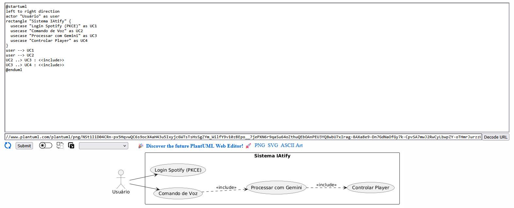

# IAtify-Docs
Documentação Técnica - IAtify (UML)

Este repositório contém a modelagem funcional do projeto IAtify utilizando a ferramenta PlantUML. A documentação foca na interação entre o usuário, a API do Spotify e o motor de IA.
Diagrama de Caso de Uso

Este diagrama descreve as funcionalidades principais, como a autenticação PKCE e o processamento de comandos de voz via Gemini.

